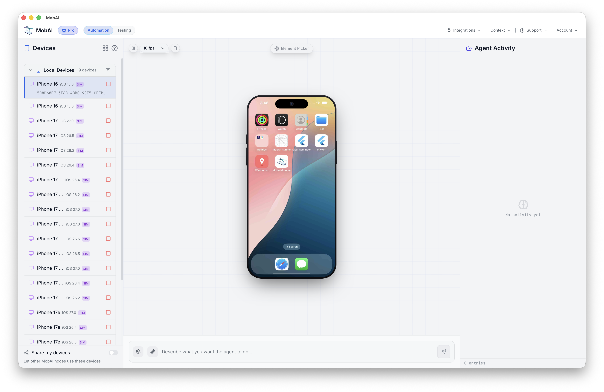

# simslim

Run a lot more iOS simulators on one Mac by turning off the background daemons a simulator doesn't need.

A freshly booted iOS simulator starts around 180 background services: Siri, Spotlight indexing, photo analysis, News, wallpaper posters, iCloud sync, and so on. None of it matters when you're using the simulator for development, testing, or CI. simslim switches those services off, which cuts each simulator's memory roughly 4x. On the same laptop you go from a handful of simulators to a screenful.



*19 iOS simulators, all under automation, on a 16 GB MacBook Pro. Stock simulators start thrashing at around 5.*

## Numbers

One simulator, booted stock and then slimmed, same device and settle time (M1 Pro, 16 GB):

| | Stock | Slim |
|---|---|---|
| Processes | 258 | 70 |
| Memory | 4.0 GB | 0.9 GB |

Memory here is phys_footprint, the figure Activity Monitor shows, which counts compressed and swapped pages. That's what decides how many simulators fit before the machine starts swapping. Run `simslim measure <udid>` to see it for any booted simulator.

## Install

```sh
brew install mobai-app/tap/simslim
```

or

```sh
go install github.com/mobai-app/simslim@latest
```

macOS only, and you need Xcode with an iOS Simulator runtime, since simslim
drives simulators through `xcrun simctl`.

## macOS app

The SwiftUI app bundles the CLI and adds:

- Searchable simulator status, disk-size, and live RAM columns.
- Searchable service profiles with per-daemon controls and purpose summaries.
- Read-only disk analysis plus confirmed cleanup of allowlisted data.
- Clone, rename, erase, delete, and Finder shortcuts.

Build it locally with Go and Xcode:

```sh
make app
open build/SimSlim.app
```

Memory estimates are guidance rather than additive savings; see the
[measurement method](docs/category-memory.md). SimSlim recommends cloning before
service or disk changes so the copy can serve as a backup.

## Usage

```sh
simslim list             # simulators and their slim status
simslim profiles         # what a slim boot turns off
simslim on <udid>        # slim a simulator and reboot it slim
simslim off <udid>       # put it back to stock
simslim status <udid>    # how slim a booted simulator is
simslim measure <udid>   # a booted simulator's memory footprint
simslim size <udid>      # total allocated simulator size
simslim disk-plan <udid> # measure reclaimable data; read-only
simslim disk-clean --categories caches,logs --confirm <udid>
simslim clone <udid> <name>
simslim rename <udid> <name>
simslim boot <udid>      # boot a simulator and wait for its services
simslim shutdown <udid>  # shut down a booted simulator
simslim erase <udid>     # erase apps, data, settings, and slimming overrides
simslim delete <udid>    # permanently delete a simulator
```

Read-only and simulator-management commands accept `--json` for integrations
and the macOS app.

## Disk cleanup

Disk cleanup is permanent and separate from service slimming. `disk-plan` is
read-only. `disk-clean` shuts down the exact simulator, clears only allowlisted
per-device directories, and refuses to run without `--confirm`.

```sh
simslim disk-categories
simslim disk-plan <udid>
simslim disk-clean --categories caches,logs,temporary --confirm <udid>
# Optional: also remove on-demand language models
simslim disk-clean --categories linguistic-data --confirm <udid>
```

Built-in apps and core OS language resources are part of a signed iOS runtime
shared by every simulator using that version, so simslim never modifies them.
Required Siri assets are measured only because iOS restores them on launch;
on-demand language data is opt-in and may download again when needed.

`disk-plan` also reports a read-only storage breakdown for installed app bundles,
Documents, app data, and user media. Those durable rows are never eligible for
cleanup. See the [disk cleanup safety model](docs/disk-cleanup.md) for recovery
behavior, safeguards, and Xcode 26.6 validation results.

Keep a category you actually need, like Spotlight search:

```sh
simslim on <udid> --except search
```

Or keep one specific daemon, like push notifications:

```sh
simslim on <udid> --keep com.apple.apsd
```

## How it works

`simslim on` writes persistent `launchctl disable` entries for the chosen daemons into the simulator's own launchd database, then reboots it. The entries stick across reboots, so the simulator comes up slim in a single boot from then on. `simslim off` clears them and reboots back to stock. Your Mac is never touched, only the simulator you point it at, and only daemons that are safe to disable. Core workflow services such as `sharingd`, plus the handful that wedge a simulator when turned off, are left running.

This is per-simulator state, not a global setting. The daemon disables live in that one simulator's launchd database. `simslim clone` preserves them, but `erase`, `delete` and recreate, or "Erase All Content and Settings" reset the simulator to stock, so you'll need to run `simslim on` again and its memory will climb back to stock until you do. A simulator created from a new or updated runtime also starts stock. Run `simslim list` to see which simulators are currently slim.

## What you lose

Turning services off is fine for most development, UI automation, and CI, but some features genuinely stop working. The ones worth knowing:

- Spotlight and in-Settings search return nothing (`search`).
- Push notifications need `apsd`, StoreKit testing needs `storekitd` (`store`).
- Universal links need `swcd` (`web`).
- The Contacts, Photos, and Calendar pickers can act up without their categories.

`simslim profiles` lists every category, so you can keep a category with `--except` or individual daemons with `--keep`.

## Why

Testing is shifting. Once agents are writing apps, you want agents running them too, and the place an iOS app runs is a simulator. One agent, one simulator. So how much work you get through at once comes down to how many simulators a machine can hold, and stock simulators are heavy enough that a laptop fills up fast. Slimming them is the cheapest way to raise that ceiling: more simulators on the box means more agents working in parallel on it.

Built for [MobAI](https://mobai.run) to run more simulators on one machine.

## License

MIT, copyright Interlap.
